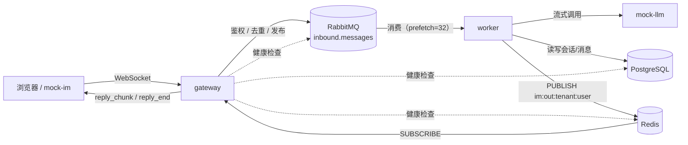

# edu-cs-bot

多租户教育平台 AI 客服机器人后端系统。完整需求见 `docs/REQUIREMENTS.md`，各阶段任务拆解见 `docs/PHASE1.md`/`docs/PHASE2.md`。

阶段一（骨架与消息全链路）已完成：客户端 WebSocket 发消息 → gateway 鉴权/校验/去重 → 投递 RabbitMQ →
收到队列确认后 ACK 客户端 → worker 消费 → 调用 mock-llm（流式）→ 回复分片经 Redis 推回 gateway → 推送给客户端。

阶段二（业务能力）已完成：在阶段一的骨架上用 LangGraph 编排出意图识别 + 七类业务节点（知识问答、
财务查询、平台指令二次确认、转人工等），细节见下面"意图路由"一节和 `docs/PHASE2.md`。

阶段三（提醒、上下文、保护、成本、演示）已完成：独立的 `scheduler` 服务扫描到期提醒并推送；
超过最近 N 条的历史对话压成摘要；gateway 加了限流和 Redis 故障降级，worker 加了熔断、有上限的
重试和死信队列；每次 LLM 调用记 token 用量、机构按天限额、Prometheus 暴露成本和运行指标；
`mock-im` 从简单聊天页面升级成带身份切换、10 个 E2E 场景快捷键和 `reply_end.meta` 透视面板的
演示控制台。细节见 `docs/PHASE3.md` 和下面各节。

## 架构图



gateway 只做接入层的事（鉴权、校验、去重、投递、回推），不调用 LLM；业务逻辑全在 worker 里。
gateway 和 worker 之间没有直接调用关系，完全靠 RabbitMQ（上行）和 Redis pub/sub（下行）解耦，
这样 worker 可以水平扩展多实例，gateway 也可以独立重启不影响正在处理中的消息。

## 设计假设

gateway 直接作为 IM 长连接入口；mock-im 扮演 IM 客户端（阶段三升级成演示控制台，见下面
`http://localhost:8080` 相关说明），用于演示和手工测试。现实场景里 gateway 前面通常还有一层
真实的 IM/网关接入层，这里为了在阶段一跑通完整链路先简化掉。

演示控制台的 `GET /api/token` 是演示专用接口，模拟"平台登录系统签发 token"这件事——真实环境里
token 应该由平台自己的登录系统签发，gateway 只负责验签（`app.common.auth.decode_access_token`），
不负责签发，签发和验证是两个独立的职责，不应该耦合在同一个服务里。mock-im 之所以要读 JWT 签名
密钥、连数据库查用户角色，是因为它在演示环境里临时扮演的是"签发方"这个角色，仅限这一个用途；
接真实平台之后，`/api/token` 这个接口和 mock-im 这一层都可以整个去掉，gateway 的验签逻辑不用动。

## 意图路由（阶段二）

worker 收到一条消息后，先过 `app/worker/graph/classify.py` 判出意图，再由
`app/worker/graph/graph.py` 路由到对应的业务节点。判定顺序是"规则先行，LLM 兜底"——前面的规则
命中就不再往后走，命中不了的最后交给 LLM function calling；LLM 挂了再降级成 worker 自己的一套
关键词兜底规则（`route_source=rule_fallback`）：

1. 当前会话有未过期（或者刚在有效期内执行完/取消）的待确认操作，且这句话是"确认……"/"取消/算了/
   不用了"这类短句 → `confirm_action` / `cancel_action`（规则）
2. 转人工关键词（转人工、人工客服、找人工、真人） → `handoff`，`trigger=keyword`（规则）
3. 不满意关键词（没用、不对、答非所问、听不懂、不满意）：命中就给会话的 `dissatisfied_count` 加
   1，其它消息清零；第 1 次命中 → `dissatisfied_first`（道歉引导），累计到第 2 次 →
   `handoff`，`trigger=dissatisfied`，并清零计数器（规则）
4. 敏感操作关键词（注销账号、改密码、换绑手机、改银行卡等） → `high_risk` → `sensitive`
   固定拒绝话术（规则）
5. 以上都没命中，交给 LLM function calling：LLM 选中的工具决定意图
   （`search_knowledge`→`knowledge_qa`、`query_finance`→`finance_query`、
   `platform_command`→`platform_command`（高风险动作会被代码改判成 `high_risk`，不是 LLM 自己说
   高风险）、`manage_reminder`→`reminder`、`transfer_to_human`→`handoff`，`trigger=llm`）；
   没选任何工具 → `chitchat`
6. 例外：短句 + 会话里有未过期的待确认操作 + LLM 判出来的结果是 `chitchat`（也就是没判出任何
   真实意图）→ 覆盖成 `confirm_ambiguous`，提醒用户要回复确切的确认短语（比如"对/是的"不算数）；
   这个覆盖故意放在 LLM 分类**之后**，避免把"发票多久能开"这类短句正常问题误判成模糊确认

意图 → 节点的完整映射见 `app/worker/graph/graph.py` 的 `_INTENT_TO_NODE`；`high_risk` 再按
`risk_flags` 是否有 `sensitive_request` 分流到 `sensitive`（固定拒绝）或 `request_confirmation`
（生成待确认操作）。

## 端口（宿主机映射，均可在 `.env` 里改）

| 服务 | 宿主机端口 | 变量 | 备注 |
|---|---|---|---|
| PostgreSQL | 5432 | `POSTGRES_HOST_PORT` | |
| Redis | **6380** | `REDIS_HOST_PORT` | 特意没用默认的 6379——本机很可能已经跑着一个原生安装的 Redis 占用 6379，脚本连 `localhost:6379` 时会悄悄连到那个而不是容器里的这个，排查起来很晕，所以容器对外映射改成 6380（容器内部还是标准的 6379，服务间互联不受影响） |
| RabbitMQ | 5672 | `RABBITMQ_HOST_PORT` | |
| RabbitMQ 管理界面 | 15672 | `RABBITMQ_MANAGEMENT_HOST_PORT` | 浏览器打开 `http://localhost:15672`，账号密码见 `.env` 的 `RABBITMQ_USER`/`RABBITMQ_PASSWORD` |
| gateway | 8000 | `GATEWAY_HOST_PORT` | `/health` `/ready` `/metrics` `/ws` |
| worker 健康检查 | 8011（可扩到 8011-8019） | `WORKER_HEALTH_HOST_PORT` | `/health` `/metrics`；业务逻辑跑在同一进程里，这个端口只做探活；写成范围是为了 `docker compose up -d --scale worker=N` 时每个副本都能各自映射到宿主机，不会因为抢同一个端口启动失败（容器内部固定还是 8001） |
| scheduler 健康检查 | 8002（可扩到 8002-8009） | `SCHEDULER_HEALTH_HOST_PORT` | `/health` `/metrics`；同样是范围端口，理由跟 worker 一致（容器内部固定是 8002） |
| mock-im | 8080 | `MOCK_IM_HOST_PORT` | 演示控制台，浏览器打开 `http://localhost:8080`：顶部切身份（自动签发 token，不用再手工粘贴），左边聊天窗口 + 10 个 E2E 场景快捷键，右边 `reply_end.meta` 透视面板 |
| mock-llm | 8100 | `MOCK_LLM_HOST_PORT` | OpenAI 兼容接口 + `/admin/config`；工具调用走确定性规则（`mocks/mock_llm/rules.py`） |
| mock-knowledge | 8101 | `MOCK_KNOWLEDGE_HOST_PORT` | `/search`（可选检索后端，见下）+ `/admin/config` |
| mock-platform | 8102 | `MOCK_PLATFORM_HOST_PORT` | `/commands`（幂等）、`/users/{id}/subscriptions`、`/admin/commands`、`/agents/status` + `/admin/config` |
| mock-finance | 8103 | `MOCK_FINANCE_HOST_PORT` | `/orders` `/bills` `/invoices` `/refunds` `/balance` + `/admin/config` |

## 启动步骤

```bash
cp .env.example .env    # 按需修改，尤其是密码类变量
make up                  # 起基础设施 + gateway/worker/scheduler + 5 个 mock 服务，等全部 healthy
                         # 后自动跑数据库迁移 + 种子数据（两个租户、七个用户）+ 建知识库索引，
                         # 一条命令到位，不用再手动跑 migrate/seed
make demo                # 生成 token -> 发消息看三个耗时 -> 同 message_id 重发看 duplicate
```

`make up` 里的迁移和种子数据都是幂等的：重复执行不会产生重复数据，也不会覆盖已经改过的机构配置
（比如压测/演示中调整过的 `daily_token_budget`）。`make migrate`/`make seed` 仍然保留成独立目标，
只是不需要在启动步骤里手动敲了；改了 `data/knowledge/` 下的文档之后单独重建索引用这个（不用重新
seed，也不用整个重新 `make up`）：

```bash
make reindex             # 等价于 docker compose run --rm tools python scripts/reindex.py
```

### 同一台机器同时跑两份代码

`docker-compose.yml` 顶层写死了 `name: edu-cs-bot`，这个字段的优先级高于目录名——同一台机器上
如果有两份 checkout（比如再 clone 一份到别的目录做对比测试），直接在两边分别 `make up` 会共用
同一套容器名、网络、数据卷，互相覆盖而不会报错。需要同时跑两份时，给其中一份设置
`COMPOSE_PROJECT_NAME` 环境变量隔离：

```bash
COMPOSE_PROJECT_NAME=edu-cs-bot-fresh make up
```

这样这一份用的容器名、网络名、数据卷名都会带 `edu-cs-bot-fresh` 前缀，跟另一份互不干扰；`make
down`/`make test`/`make demo` 等其它目标也要带着同样的环境变量才会操作到对应的那一份。

跑起来之后可以：
- 浏览器打开 `http://localhost:8080`（演示控制台），顶部下拉框选一个身份直接连（token 由控制台后端现场签发，不用再手工跑 `gen_token.py` 粘贴），左下角点 10 个 E2E 场景按钮快捷发送，右边看每次回复的透视面板
- 浏览器打开 `http://localhost:15672`（RabbitMQ 管理界面），看 `inbound.messages`/`inbound.dead` 两个队列
- `make logs` 看所有服务的结构化 JSON 日志
- `docker compose stop mock-llm` 之后再发消息，验证 worker 会推送降级回复且不崩
- `docker compose run --rm tools python scripts/phase2_smoke.py` 把阶段二的 9 个 E2E 场景串起来跑一遍，打印 PASS/FAIL
- `docker compose run --rm tools python scripts/phase3_smoke.py` 把阶段三的场景（提醒推送/修改/取消、上下文摘要、限流、熔断、预算降级）串起来跑一遍
- 浏览器打开 `http://localhost:8011/metrics`（端口以 `docker compose port worker 8001` 实际输出为准）看 worker 的 Prometheus 指标

## 命令行工具（`scripts/`）

都跑在一次性的 `tools` 容器里（`docker compose run --rm tools python scripts/xxx.py ...`）：

| 脚本 | 用途 |
|---|---|
| `chat.py --tenant t_a --user u_a_1001 --conv c1 "你好"` | 命令行多轮对话：生成 token、连 gateway、发一条消息、打印 ack/流式回复/`reply_end` 的 `meta`。同一个 `--conv` 标签会延续同一个会话（内部用 `uuid5(tenant:user:标签)` 映射成固定的 `conversation_id`）；加 `--message-id <上次的id>` 重发同一条消息可以测试去重 |
| `mockctl.py <llm\|finance\|platform> show` | 打印某个 mock 服务当前的 `/admin/config` |
| `mockctl.py <llm\|finance\|platform> reset` | 把某个 mock 服务恢复成默认配置 |
| `mockctl.py <llm\|finance\|platform> key=value ...` | 改某个 mock 服务的运行时行为，比如 `mockctl.py llm mode=invalid_json`、`mockctl.py finance mode=timeout`、`mockctl.py platform mode=slow_commit`、`mockctl.py platform agents_online=false` |
| `mockctl.py platform show-commands` | 打印 mock-platform 的 `/admin/commands`（已执行过的平台指令，按幂等键去重后的结果），用来验证"同一个幂等键只真正执行一次" |
| `mockctl.py all reset` | 一次性重置 llm/finance/platform 三个 mock，验证脚本跑之前和跑完都应该调这个 |
| `sql.py "select ..."` | 只读地跑一条 SQL 查询并打印结果表格（写操作会被拒绝），用来验证数据库里的最终状态 |
| `finance_probe.py --tenant t_a --acting u_a_1001 --target u_a_1004 --kind invoices` | 绕过 worker，直接以某人身份请求 mock-finance，证明 mock-finance 自己也会独立拒绝越权 |
| `reindex.py` | 增量重建知识库索引（按文件内容哈希判断要不要重算），`--force` 全量重建 |
| `phase2_smoke.py` | 阶段二收尾冒烟测试，串起 9 个 E2E 场景 |
| `phase3_smoke.py` | 阶段三冒烟测试：提醒推送/修改/取消、上下文摘要、限流、熔断降级、预算降级 |
| `rate_limit_burst.py --tenant t_a --user u_a_1001` | 10 秒内连发 N 条消息，打印每条 ack 状态，验证限流阈值 |
| `dlq_replay.py` | 把 `inbound.dead` 里的消息逐条取出、`x-retry-count` 清零后重新投回 `inbound.messages`（根因修好之后找回死信） |
| `seed.py` | 种子数据（可重复跑） |
| `gen_token.py --tenant t_a --user u_a_1001` | 生成一个 JWT；演示控制台自己会现场签发 token，这个脚本主要给 `chat.py`/`sql.py` 之外的手工排查用 |

## 知识库文件格式（`data/knowledge/{tenant_id}/*.md`）

每个租户一个目录，目录下每个 `.md` 文件是一篇文档。格式固定，由 `app/common/knowledge_parser.py`
解析：开头是 YAML front matter（`doc_id`/`title`/`tenant_id`/`tenant_name`/`version`/`updated_at`
都必填，`tenant_id` 必须和所在目录一致，不一致整份文档解析失败），往后 `## ` 表示章、`### ` 表示
条款——条款标题行的第一个词就是条款号（如 `4.2`、`Q3`），后面是条款标题，一个条款切成一个检索块：

```markdown
---
doc_id: service_agreement
title: 课程服务协议
tenant_id: t_a
tenant_name: 星辰教育
version: 2026.09
updated_at: 2026-09-01
---

# 星辰教育《课程服务协议》

## 第二章 课程与课时

### 2.2 排课与课程表
每期课程表在开课前 7 天公布……
```

改完文档跑 `make reindex`（或 `docker compose run --rm tools python scripts/reindex.py`）：按文件
内容哈希判断要不要重算，没变的文档跳过；目录里被删掉的文档，连同它的检索块一起删除；`--force`
参数忽略哈希强制全量重建。

## `reply_end` 的 `meta` 字段

worker 处理完一条消息，最后一帧 `reply_end` 会带一个 `meta` 对象，供客户端调试/前端展示用（字段
定义见 `app/worker/graph/graph.py` 的 `_build_meta`）：

| 字段 | 说明 |
|---|---|
| `intent` | 这轮判出来的意图，见上面"意图路由"一节的取值 |
| `route_source` | 意图是怎么判出来的：`rule`（worker 规则命中）、`llm`（LLM function calling）、`rule_fallback`（LLM 调用失败，降级成 worker 自己的关键词规则） |
| `tools` | 这轮尝试解析/调用过的工具，`[{"name": ..., "status": ...}]`；`status` 常见取值：`ok`/`forbidden`/`invalid_json`/`schema_error`/`upstream_error`/`not_found`/`pending_confirmation`/`need_clarification`/`no_op` 等，具体含义看各业务节点 |
| `citations` | 知识问答命中的检索结果（`doc_title`/`clause_no`/`score`），非知识问答场景是空数组 |
| `pending_action_id` | 这轮涉及的待确认操作 id（生成/确认/取消/模糊提醒都会带），不涉及则为 `null` |
| `handoff_ticket_id` | 这轮生成的转人工记录 id，不涉及则为 `null` |
| `guard.dropped_sentences` | OutputGuard 因为出处核对不通过而整句丢弃的句子数（只有知识问答场景会 >0） |
| `guard.banned_phrases_removed` | OutputGuard 删掉的禁用套话（"作为AI"之类）出现次数 |
| `risk_flags` | 这轮命中的风险标记，如 `sensitive_request`、`prompt_injection_suspected`；转人工记录里还会额外汇总 `finance_forbidden_attempt`、`repeated_dissatisfaction`、`high_risk_pending`（见 `app/worker/graph/handoff.py`） |
| `context.history_messages` / `context.has_summary` | 阶段三第 3 步：这轮 LLM 请求带了几条原文历史、有没有附带历史摘要 |
| `circuit_breaker` | 阶段三第 5 步：这轮因为熔断打开被跳过、没真的发请求的服务名，如 `["llm"]`、`["finance"]`，没有就是空数组 |
| `budget_exceeded` | 阶段三第 6 步：机构今日 token 预算是否已经用完导致这轮跳过了 LLM 调用 |

## 目录说明

```
app/
  common/      # gateway/worker/scheduler 共用：config/logging/db/redis/mq/auth/schemas/models/
               # masking/permissions/tools/platform_client/finance_client/retrieval/embedding/...
  gateway/     # WebSocket 接入层：鉴权、去重、投递 MQ、ACK、Redis 推送转发（不调用 LLM）
  worker/      # 消费队列：LangGraph 编排（意图路由 + 业务节点）、调 LLM、写回复、推流式分片
    graph/     # classify/knowledge/finance/command/handoff/guard/style 等节点实现
  scheduler/   # 独立服务：每秒扫一次到期提醒，FOR UPDATE SKIP LOCKED 取批、先推送再提交
mocks/
  mock_im/         # 演示控制台：身份切换（现场签发 token）、聊天窗口、场景快捷键、meta 透视面板
  mock_llm/        # OpenAI 兼容的假 LLM，工具调用走确定性规则（rules.py），行为可通过 /admin/config 调整
  mock_knowledge/  # 假检索后端（可选，RETRIEVER=mock_knowledge 时启用）
  mock_platform/   # 假平台指令系统：低风险/高风险指令、幂等键、故障模式
  mock_finance/    # 假财务系统：订单/账单/发票/退费/余额，自己也做一层越权校验
docker/
  app.Dockerfile   # gateway / worker / scheduler / tools 共用
  mocks.Dockerfile # 5 个 mock 服务共用；镜像里也拷贝了 app/（阶段三第 7 步加的），
                   # 但只有 mock-im 用得到（现场签发 token 要用 app.common.auth/db），
                   # 其余 4 个 mock 服务不引用这些模块
migrations/    # Alembic 迁移
scripts/       # 命令行工具，见上面"命令行工具"一节
tests/unit/    # 纯函数和轻量假对象单测（pytest + pytest-asyncio），不连真实数据库；
               # 涉及数据库/mock 服务的验证走 docker compose 起真实服务手工/脚本验证，见各步骤文档
docs/          # REQUIREMENTS.md（需求原文）、PHASE*.md（各阶段任务拆解）、phase2_threshold.md（检索阈值标定）
```

## Makefile 目标

| 目标 | 作用 |
|---|---|
| `make up` | 启动基础设施 + gateway/worker/scheduler + 5 个 mock 服务（不含 `tools`，见下），等全部 healthy 后自动跑 `migrate` + `seed`，幂等，可重复执行 |
| `make down` | 停止所有服务 |
| `make logs` | 跟着看所有服务日志 |
| `make ps` | 看各服务状态 |
| `make migrate` | 跑 Alembic 迁移 |
| `make seed` | 种子数据（可重复跑）+ 建知识库索引 |
| `make reindex` | 只重建知识库索引，不重新种子数据 |
| `make demo` | 见上面"启动步骤" |
| `make test` | 单测（`tools` 镜像）+ mock-llm 专属单测（`mocks-tools` 镜像，见下）+ 集成 + e2e，共四层 |
| `make loadtest-users` | 生成压测用户 + token（t_a 下 1600 个，写进不进 git 的 `loadtest/tokens.json`）。下面四个场景目标都会自动依赖这个目标，不需要手动单独跑；每次都会重新生成（用户是幂等的，token 6 小时过期，重新生成保证不会拿到过期 token） |
| `make loadtest-steady` | 压测场景 1：稳定（500 连接，200 msg/s，5 分钟） |
| `make loadtest-burst` | 压测场景 2：突发（≥1000 VU，1000 msg/s，30 秒，另跑 3 分钟观察队列消化） |
| `make loadtest-finance` | 压测场景 3：财务查询（100 QPS，2 分钟） |
| `make loadtest-llm-timeout` | 压测场景 4：LLM 超时率 20%（内部用 `mockctl.py` 设置/重置，`trap` 保证不管成败都会重置） |
| `make loadtest` | 依次跑完上面四个场景 |

`migrate`/`seed`/`reindex`/`demo` 实际上跑在一个叫 `tools` 的一次性容器里（跟 gateway/worker 共用
同一个镜像），`docker-compose.yml` 里给它设了 `profiles: ["tools"]`，所以 `make up` 不会把它一起
启动，只有 `docker compose run --rm tools ...` 显式点名才会临时起一个，干完活自动退出，不会一直占
资源；上面"命令行工具"一节列的脚本都是这样跑的。

## 新增的环境变量（阶段二）

完整列表和注释见 `.env.example`，这里只列阶段二新增、且不是"密码/密钥"类的关键项：

| 变量 | 默认值 | 说明 |
|---|---|---|
| `EMBEDDING_PROVIDER` | `hash` | 知识库向量化方式，目前只有确定性哈希向量一种实现，不依赖网络/模型 |
| `RETRIEVER` | `pgvector` | 检索后端：`pgvector`（主路径）或 `mock_knowledge`（验证"检索也可以是外部系统"） |
| `KNOWLEDGE_MIN_SCORE` | `0.30` | pgvector 检索分数低于这个值就认为没查到明确依据，直接走固定话术，不调用 LLM |
| `MOCK_KNOWLEDGE_MIN_SCORE` | `0.04` | mock_knowledge 检索器的阈值，打分尺度和 pgvector 不同，单独标定，见 `docs/phase2_threshold.md` |
| `FINANCE_TIMEOUT_SECONDS` | `1.5` | worker 调 mock-finance 的超时；只对超时/5xx/连接错误重试 1 次，403/401 不重试 |
| `MOCK_FINANCE_MODE` | `normal` | mock-finance 故障模式：`normal`/`timeout`/`error500`，用 `mockctl.py finance mode=...` 运行时切换 |
| `PLATFORM_TIMEOUT_SECONDS` | `3` | worker 调 mock-platform 的超时；只对超时/5xx/连接错误重试，最多 2 次，间隔 0.5s/1s |
| `MOCK_PLATFORM_MODE` | `normal` | mock-platform 故障模式：`normal`/`timeout`（永久挂起，验证重试耗尽）/`slow_commit`（延迟后成功，验证幂等键找回结果）/`error500` |
| `PENDING_ACTION_TTL_SECONDS` | `300` | 高风险指令待确认操作的有效期，超过还没确认就按超时处理 |

## 新增的环境变量（阶段三）

同样只列关键项、不是"密码/密钥"类的，完整列表见 `.env.example`：

| 变量 | 默认值 | 说明 |
|---|---|---|
| `CONVERSATION_HISTORY_LIMIT` | `10` | 最近几条消息原样保留，更早的压成摘要；摘要超过这个阈值的未覆盖消息数才重新生成 |
| `SCHEDULER_INTERVAL_SECONDS` | `1` | scheduler 扫描到期提醒的间隔 |
| `SCHEDULER_BATCH_SIZE` | `100` | scheduler 每轮 `FOR UPDATE SKIP LOCKED` 最多取几条 |
| `RATE_LIMIT_USER_PER_10S` | `20` | 单用户 10 秒内最多几条消息，超了 ack 返回 `rate_limited` |
| `RATE_LIMIT_TENANT_PER_SEC` | `2000` | 单机构每秒最多几条消息 |
| `REDIS_RECONNECT_MIN_SECONDS` / `REDIS_RECONNECT_MAX_SECONDS` | `0.5` / `30` | gateway 订阅 Redis 频道断线重连的退避区间（翻倍增长，封顶后面这个值） |
| `CB_FAILURE_THRESHOLD` / `CB_OPEN_SECONDS` | `5` / `30` | LLM、mock-finance 各自的熔断器：连续失败几次打开、打开多久后进入半开试探 |
| `LLM_MAX_RETRIES` / `FINANCE_MAX_RETRIES` / `PLATFORM_MAX_RETRIES` | `1` / `1` / `2` | 各自的重试次数上限（重试之间的退避间隔另有单独的配置项，见 `.env.example`） |
| `DLQ_MAX_RETRIES` | `3` | 消息处理时出现意外异常，重新入队几次还失败就进 `inbound.dead` |
| `DEFAULT_DAILY_TOKEN_BUDGET` | 空（不限额） | 机构没在 `tenants.daily_token_budget` 单独设置时用这个值 |

## 新增的环境变量（阶段四）

| 变量 | 默认值 | 说明 |
|---|---|---|
| `LLM_NONSTREAM_TIMEOUT_SECONDS` | `3` | classify 这类非流式 LLM 调用的超时，超时不重试（阶段四故障注入把原来的 `LLM_TIMEOUT_SECONDS=15` 拆成非流式/流式两个更短的值，重试也从"超时重试一次"改成"超时不重试"） |
| `LLM_STREAM_TIMEOUT_SECONDS` | `4` | respond 阶段流式生成的超时，超时不重试；比非流式多给 1 秒是因为流式要先等首字节，理由见 `loadtest/llm_timeout.js` 顶部注释 |

## 压测（阶段四 4.6）

四个场景（稳定/突发/财务查询/LLM 超时率 20%）的脚本在 `loadtest/`，跑法见上面 Makefile
目标表。压测跑了两轮：第一轮的 k6 脚本是"每条消息各自建一次连接"的短连接模型，且跑的时候
t_a 机构的每日 LLM token 预算被打满，两个问题都让结果测不到题目原本要测的路径，已作废；
第二轮把 `loadtest/lib/ws_client.js` 改成长连接模型（每个 VU 建一条连接、持续发消息，
`message_id`/`reply_to` 匹配每条在途消息），解除了预算限制，是当前有效结果，其中场景 1 额外
对比了 1 个 worker 和 3 个 worker 的差异。详细数字、方法、单 worker 吞吐上限的原因分析、
下一个瓶颈（Postgres）都写在 [`docs/LOADTEST.md`](docs/LOADTEST.md)，不在这里重复。
