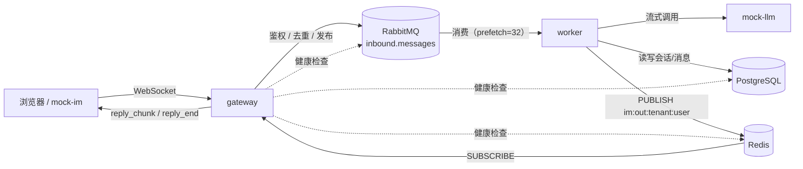

# edu-cs-bot

多租户教育平台 AI 客服机器人后端系统。完整需求见 `docs/REQUIREMENTS.md`，当前阶段任务见 `docs/PHASE1.md`。

阶段一（骨架与消息全链路）已完成：客户端 WebSocket 发消息 → gateway 鉴权/校验/去重 → 投递 RabbitMQ →
收到队列确认后 ACK 客户端 → worker 消费 → 调用 mock-llm（流式）→ 回复分片经 Redis 推回 gateway → 推送给客户端。

## 架构图



gateway 只做接入层的事（鉴权、校验、去重、投递、回推），不调用 LLM；业务逻辑全在 worker 里。
gateway 和 worker 之间没有直接调用关系，完全靠 RabbitMQ（上行）和 Redis pub/sub（下行）解耦，
这样 worker 可以水平扩展多实例，gateway 也可以独立重启不影响正在处理中的消息。

## 设计假设

gateway 直接作为 IM 长连接入口；mock-im 扮演 IM 客户端（一个简单网页聊天界面），用于演示和手工测试。
现实场景里 gateway 前面通常还有一层真实的 IM/网关接入层，这里为了在阶段一跑通完整链路先简化掉。

## 端口（宿主机映射，均可在 `.env` 里改）

| 服务 | 宿主机端口 | 变量 | 备注 |
|---|---|---|---|
| PostgreSQL | 5432 | `POSTGRES_HOST_PORT` | |
| Redis | **6380** | `REDIS_HOST_PORT` | 特意没用默认的 6379——本机很可能已经跑着一个原生安装的 Redis 占用 6379，脚本连 `localhost:6379` 时会悄悄连到那个而不是容器里的这个，排查起来很晕，所以容器对外映射改成 6380（容器内部还是标准的 6379，服务间互联不受影响） |
| RabbitMQ | 5672 | `RABBITMQ_HOST_PORT` | |
| RabbitMQ 管理界面 | 15672 | `RABBITMQ_MANAGEMENT_HOST_PORT` | 浏览器打开 `http://localhost:15672`，账号密码见 `.env` 的 `RABBITMQ_USER`/`RABBITMQ_PASSWORD` |
| gateway | 8000 | `GATEWAY_HOST_PORT` | `/health` `/ready` `/metrics` `/ws` |
| worker 健康检查 | 8001 | `WORKER_HEALTH_HOST_PORT` | `/health` `/metrics`；业务逻辑跑在同一进程里，这个端口只做探活 |
| mock-im | 8080 | `MOCK_IM_HOST_PORT` | 浏览器打开 `http://localhost:8080` 手工聊天 |
| mock-llm | 8100 | `MOCK_LLM_HOST_PORT` | OpenAI 兼容接口 + `/admin/config` |
| mock-knowledge | 8101 | `MOCK_KNOWLEDGE_HOST_PORT` | 本阶段只有 `/health` |
| mock-platform | 8102 | `MOCK_PLATFORM_HOST_PORT` | 本阶段只有 `/health` |
| mock-finance | 8103 | `MOCK_FINANCE_HOST_PORT` | 本阶段只有 `/health` |

## 启动步骤

```bash
cp .env.example .env    # 按需修改，尤其是密码类变量
make up                 # 起基础设施 + gateway/worker + 5 个 mock 服务
make migrate             # 建表
make seed                # 种两个租户、六个用户
make demo                # 生成 token -> 发消息看三个耗时 -> 同 message_id 重发看 duplicate
```

跑起来之后可以：
- 浏览器打开 `http://localhost:8080`（mock-im），粘贴 `docker compose run --rm tools python scripts/gen_token.py --tenant t_a --user u_a_1001` 生成的 token，手工聊天
- 浏览器打开 `http://localhost:15672`（RabbitMQ 管理界面），看 `inbound.messages`/`inbound.dead` 两个队列
- `make logs` 看所有服务的结构化 JSON 日志
- `docker compose stop mock-llm` 之后再发消息，验证 worker 会推送降级回复且不崩

## 目录说明

```
app/
  common/      # gateway/worker/scheduler 共用：config/logging/db/redis/mq/auth/schemas/llm_client/models
  gateway/     # WebSocket 接入层：鉴权、去重、投递 MQ、ACK、Redis 推送转发
  worker/      # 消费队列：会话归属校验、幂等入库、调 LLM、写回复、推流式分片
  scheduler/   # 占位，后续阶段的提醒调度
mocks/
  mock_im/         # 网页聊天客户端，演示和手工测试用
  mock_llm/        # OpenAI 兼容的假 LLM，行为可通过 /admin/config 运行时调整
  mock_knowledge/  # 占位，阶段二实现检索接口
  mock_platform/   # 占位
  mock_finance/    # 占位
docker/
  app.Dockerfile   # gateway / worker / scheduler / tools 共用
  mocks.Dockerfile # 5 个 mock 服务共用
migrations/    # Alembic 迁移
scripts/       # seed.py / gen_token.py / ws_client.py / demo.sh
tests/         # 占位，阶段一暂无自动化测试（make test 待实现）
docs/          # REQUIREMENTS.md（需求原文）、PHASE*.md（各阶段任务拆解）
```

## Makefile 目标

| 目标 | 作用 |
|---|---|
| `make up` | 启动基础设施 + gateway/worker + 5 个 mock 服务（不含 `tools`，见下） |
| `make down` | 停止所有服务 |
| `make logs` | 跟着看所有服务日志 |
| `make ps` | 看各服务状态 |
| `make migrate` | 跑 Alembic 迁移 |
| `make seed` | 种子数据（可重复跑） |
| `make demo` | 见上面"启动步骤" |
| `make test` | 待实现（阶段一暂无自动化测试） |
| `make loadtest` | 待实现（阶段四压测再做） |

`migrate`/`seed`/`demo` 实际上跑在一个叫 `tools` 的一次性容器里（跟 gateway/worker 共用同一个镜像），
`docker-compose.yml` 里给它设了 `profiles: ["tools"]`，所以 `make up` 不会把它一起启动，
只有 `docker compose run --rm tools ...` 显式点名才会临时起一个，干完活自动退出，不会一直占资源。
