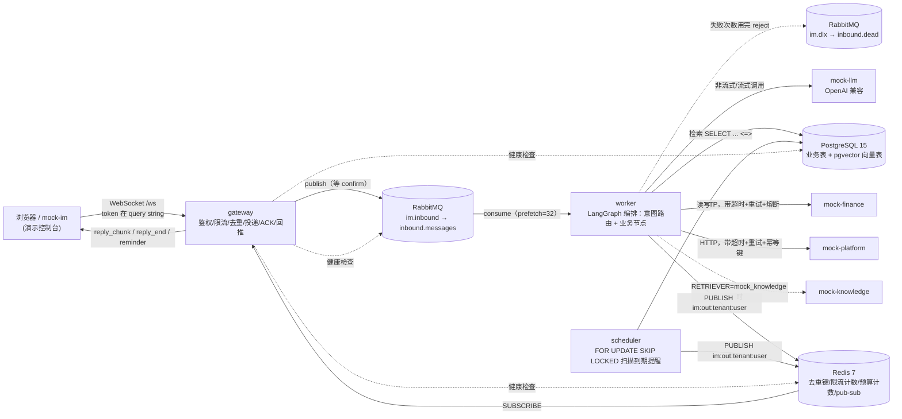

# 架构与设计说明

对应 `docs/PHASE5.md` 5.5。只写已经实现并验证过的内容，每条设计取舍附代码位置。

## 整体架构

gateway 只做接入层的事（鉴权、校验、限流、去重、投递、回推），不调用 LLM，`app/gateway/main.py`
文件头注释就是这句话；业务逻辑全在 worker 里。gateway 和 worker 之间没有直接调用关系，完全靠
RabbitMQ（上行）和 Redis pub/sub（下行）解耦。

## 一条消息的完整路线

跟演示控制台"架构路线图"画的是同一条路线（`mocks/mock_im/templates/index.html:683-730` 的
`ARCH_NODES`/`ARCH_EDGES`/`ARCH_PATH_TO_BIZ`/`ARCH_PATH_FROM_BIZ`），节点名和顺序逐一对应。

### 去程：浏览器 → worker 业务流程

| 顺序 | 路线图节点 | 做什么 | 代码位置 |
|---|---|---|---|
| 1 | 浏览器 | 建立 WebSocket 连接，`token` 放在 query string（不放 header，`ws://` 原生不支持自定义 header） | 客户端；`mocks/mock_im/templates/index.html` |
| 2 | gateway 鉴权 | `accept()` 完成握手后才能带自定义 close code；解出 `token` 校验签名，失败关 4401 | `app/gateway/main.py:62-89` `ws_endpoint()` |
| 3 | Redis 限流 | 查 `check_user_and_tenant_rate_limit`，超限直接回 `ack status=rate_limited`，不写去重键 | `app/gateway/message_handler.py:111-116`（限流逻辑见 `app/common/rate_limit.py`） |
| 4 | Redis 去重 | `SET dedup:{tenant}:{message_id} NX EX`，已存在直接回 `ack status=duplicate` | `app/gateway/message_handler.py:118-134` |
| 5 | RabbitMQ 投递 | 组装消息体，`exchange.publish(..., timeout=...)`，等 publisher confirm 返回才算成功 | `app/gateway/message_handler.py:44-76` `_publish_inbound()` |
| 6 | 回 ACK | 投递确认成功后才回 `ack status=accepted` | `app/gateway/message_handler.py:151-153` |
| 7 | RabbitMQ 队列 | 消息落在 `inbound.messages`（durable，带 `x-dead-letter-exchange=im.dlx`） | `app/common/mq.py:40-58` `declare_topology()` |
| 8 | worker 取消息 | `channel.set_qos(prefetch_count=32)`，消费者收到消息 | `app/worker/consumer.py:132-140` `run_consumer()` |
| 9 | 数据库去重 | `INSERT ... ON CONFLICT DO NOTHING` 到 `messages` 表，冲突再查 `status` 判断是全新/中断重试/真重复 | `app/worker/handler.py:52-89` `_upsert_user_message()` |
| 10 | worker 业务流程 | `load_context → classify → 条件路由 → 业务节点` 的 LangGraph 编排 | `app/worker/graph/graph.py:107-135` `_build_graph()` |

### worker 业务流程内部（下游依赖，路线图上是四个虚线图标）

| 下游 | 触发条件 | 代码位置 |
|---|---|---|
| mock-llm | 意图分类（非流式）、生成正文（流式）、转人工摘要 | `app/common/llm_client.py`（分类调用见 `app/worker/graph/classify.py:198-211`，生成调用见 `app/worker/graph/graph.py:242-247`） |
| 知识库(pgvector) | 意图=知识问答 | `app/worker/graph/knowledge.py:58-59`，检索实现 `app/common/retrieval.py` |
| mock-finance | 意图=财务查询 | `app/worker/graph/finance.py:213-220` `fetch_finance_data()`（客户端 `app/common/finance_client.py`） |
| mock-platform | 意图=平台指令（低风险直接执行/高风险确认后执行） | `app/worker/graph/command.py:201-204`、`:424-431`（客户端 `app/common/platform_client.py`） |

### 回程：worker 业务流程 → 浏览器

| 顺序 | 路线图节点 | 做什么 | 代码位置 |
|---|---|---|---|
| 11 | 回复写入数据库 | `respond()` 把 `reply_plan` 转成真正的回复文本，写 `messages` 表（assistant 角色），标当前用户消息 `status=replied` | `app/worker/handler.py:219-227`；生成逻辑 `app/worker/graph/graph.py:217-311` `respond()` |
| 12 | Redis 推送 | 按句子 `PUBLISH im:out:{tenant}:{user}`（`reply_chunk`），最后发 `reply_end`（带 `meta`） | `app/worker/pubsub.py`（调用处 `app/worker/graph/graph.py:229,309`） |
| 13 | gateway | 每个 `(tenant_id, user_id)` 的第一个连接建立时才订阅对应 Redis 频道，收到消息转发给该用户当前所有本地连接 | `app/gateway/connection_manager.py:35-121` |
| 14 | 浏览器 | 收到 `reply_chunk`/`reply_end`，渲染流式回复 | 客户端 |

### 提醒推送（scheduler → 浏览器，路线图上是虚线支线）

scheduler 每秒扫一次到期提醒，走同一条 Redis 频道、同一条 gateway 转发链路，客户端靠 `type`
字段区分是对话回复还是提醒（`ReminderPushMessage`，`type="reminder"`）：

`app/scheduler/loop.py:51-122` `_process_due_reminders()` → `app/scheduler/pubsub.py`
`publish_reminder_push()` → `app/gateway/connection_manager.py`（同回程步骤 13）→ 浏览器。

## 关键设计取舍

每条：做了什么 / 为什么 / 代价，附代码位置。

### 1. gateway 和 worker 分离

**做了什么**：gateway 只管 WebSocket 接入、鉴权、限流、去重、投递、回推，不调用 LLM/知识库/
财务/平台；业务逻辑（意图路由、工具调用、生成回复）全部在 worker，两者只通过 RabbitMQ（上行）
和 Redis pub/sub（下行）通信，没有直接的服务间调用。`app/gateway/main.py:1`、
`app/worker/handler.py:1`。

**为什么**：worker 要调 LLM/下游服务，耗时不确定（几百毫秒到几秒），如果跟 gateway 长在一起，
慢请求会占住处理 WebSocket 帧的资源；分离后 worker 可以水平扩展多实例（`docker compose up -d
--scale worker=3`），gateway 也能独立重启不影响正在处理中的消息。

**代价**：多了一层队列和 pub/sub，消息路径变长，需要处理"消息在两者之间某一跳丢失/重复"的
问题（见下面第 3 条两层去重）。

### 2. 先等队列确认再回 ACK

**做了什么**：gateway 收到消息后先限流、去重，再 `exchange.publish(..., timeout=...)` 投递到
RabbitMQ，等 publisher confirm 真正返回成功后才回 `ack status=accepted`；投递失败会先删掉刚写的
去重键再回错误，不回 ack。`app/gateway/message_handler.py:64-76`（confirm）、`:136-153`
（ack 时机）。

**为什么**：如果先回 ack 再投递，投递失败时客户端已经认为"发送成功"，但消息其实没进队列，
造成真实的消息丢失。

**代价**：每条消息多等一次 broker confirm 的网络往返，ACK 延迟比"发布后立即返回"更高。

### 3. 两层去重和 status 字段

**做了什么**：第一层是 gateway 的 Redis `SET NX EX`（`dedup:{tenant_id}:{message_id}`，TTL
`DEDUP_TTL_SECONDS`）；第二层是 worker 侧 `messages` 表的 `(tenant_id, message_id)` 唯一约束
+ `status`（`received`/`replied`）字段，`ON CONFLICT DO NOTHING` 冲突后还要查一次 `status`
才能判断是"全新消息"、"处理到一半中断，要重新生成回复"还是"已经完整回复过的真重复"。
`app/gateway/message_handler.py:118-134`；`app/worker/handler.py:52-89`
`_upsert_user_message()`。

**为什么**：只判断"插没插成功"不够——worker 在写入用户消息之后、生成回复之前崩溃的话，
消息已经"插过"，但用户没收到回复；如果只看有没有插入过就跳过，这条消息会永久丢失回复
（阶段一真实复现过，见 `AGENT_LOG.md` 索引第 3 条）。Redis 这层快、能挡住绝大多数正常重试；
DB 唯一约束是兜底，Redis 故障或 key 过期时仍然不会产生重复业务记录。

**代价**：Redis 故障时去重降级到只剩 DB 层（去重生效时间点从"入队前"推迟到"入库时"），
一条消息可能被投递进队列两次，多消耗一点队列/worker 资源，但不会产生重复的用户消息记录。

### 4. 限流放在去重前面

**做了什么**：`handle_inbound_message()` 先查限流，通过了才检查去重键。
`app/gateway/message_handler.py:1-4`（文件头注释）、`:111-134`。

**为什么**：被限流的消息不写去重键——如果顺序反过来，用户被限流后稍后用同一个 `message_id`
重发，会被误判成"重复消息"直接吃掉，用户永远收不到这条消息的处理结果。

**代价**：无明显代价，是纯粹的顺序选择。

### 5. 规则先行的意图识别，以及 LLM 失败时的降级

**做了什么**：`classify()` 按固定顺序先过一遍规则（待确认操作的确认/取消 → 转人工关键词 →
不满意计数 → 敏感操作关键词），全部不命中才交给 LLM function calling；LLM 调用失败/超时/熔断
打开时降级成 worker 自己的一套关键词规则（`route_source=rule_fallback`）。
`app/worker/graph/classify.py:1-12`（文件头）、`:266-324` `_classify_core()`、`:138-154`
`_keyword_fallback_classify()`。

**为什么**：确认/取消、转人工、敏感操作这几类涉及安全和用户体验的关键路径不该完全依赖 LLM
的判断稳定性；LLM 挂了也不能让整条消息处理链路瘫痪，至少给一个基于关键词的兜底意图。

**代价**：关键词规则是字面匹配，词序变化、同义表达会漏判（`docs/KNOWN_ISSUES.md` 第 5、25 条：
"你好，在吗"曾被误判、"银行卡改一下"不命中"改银行卡"）。

### 6. 工具调用的三关校验

**做了什么**：
1. **白名单 + JSON Schema 校验**：`parse_tool_call()` 是唯一入口，工具名不在注册表里直接拒绝，
   参数用 Pydantic 模型（`extra="forbid"`）校验，同一份模型既生成给 LLM 看的 JSON Schema、
   又校验 LLM 的返回。`app/common/tools.py:241-259`。
2. **业务权限/身份校验**：LLM 只负责说清楚"用户想做什么"，身份（`tenant_id`/`user_id`/角色）
   只能来自 JWT + 数据库查询，从不信任 LLM 输出里的身份字段；财务查询额外过
   `can_access_finance()`。`app/common/permissions.py:23-31`。
3. **高风险动作二次确认才真正执行**：`platform_command` 里的高风险动作（关闭/开通自动续费、
   请假）不会被直接执行，先落一条 `PendingAction`，用户明确回复确认短语后才真正调用
   `submit_command()`。`app/worker/graph/command.py:237-350`（生成待确认）、`:353-420`
   （确认才执行）。

**为什么**：CLAUDE.md 硬性规则 9"LLM 输出不得直接执行"——LLM 的输出本质上是不可信输入，
必须像用户输入一样经过校验才能驱动真实操作。

**代价**：高风险动作要两轮对话才能完成（多一次往返），代码路径变多（`PendingActionStatus` 有
6 种状态），测试成本更高。

### 7. pgvector 和业务数据放在同一个库

**做了什么**：知识库向量存在 `knowledge_chunks.embedding`（`pgvector.sqlalchemy.Vector(512)`），
跟 `tenants`/`users`/`messages` 等业务表在同一个 PostgreSQL 实例里，迁移里
`CREATE EXTENSION IF NOT EXISTS vector` 一句话启用。`app/common/models.py:7,155-174`；
`migrations/versions/202609230001_init_schema.py:21-22`。

**为什么**：不用额外运维一个独立的向量数据库服务，一套连接池、一套备份策略，业务数据和向量
数据可以在同一个事务/查询里关联（比如按 `tenant_id` 过滤检索范围，天然利用已有的行级隔离）。

**代价**：向量检索的水平扩展和关系型业务负载绑在一起，不能独立扩容；换向量库/换 embedding
维度需要走标准的表结构迁移，不像专门的向量数据库那样有更丰富的索引调优生态。

### 8. 知识问答防幻觉的几层

**做了什么**：
- **阈值**：检索分数低于 `KNOWLEDGE_MIN_SCORE`（或 `MOCK_KNOWLEDGE_MIN_SCORE`）的结果直接
  当"没查到"，不进入生成环节。`app/worker/graph/knowledge.py:72,95-100`。
- **资料放在 user 消息里**：命中的条款原文拼进 `<资料>` 块，放进 user 角色消息，不放进
  system prompt。`app/worker/graph/knowledge.py:119-127`；块结构见 `app/common/prompt_guard.py`
  `build_reference_block()`。
- **出处开头由代码写**：`《文档名》第 X 条` 这句由 `_build_lead_in()` 拼接，不是 LLM 生成。
  `app/worker/graph/knowledge.py:49-51`。
- **OutputGuard 逐句核对出处**：LLM 生成的每句话如果引用了不在这次检索允许范围内的
  `《书名》第 N 条`，整句丢弃。`app/worker/graph/guard.py:83-103`。

**为什么**：CLAUDE.md 硬性规则 8"用户输入不得拼进 system prompt"（资料本质上也是外部内容，
同样处理）；多层独立防线是为了让"LLM 编造一个看起来真实的条款号"这种单点失效不会直接
到达用户——阈值挡住低置信度、出处格式由代码保证不被绕过、OutputGuard 挡住 LLM 编出的假出处。

**代价**：哈希向量阈值既会漏判（同义词查不到）也会误判（不相关内容分数偶然超阈值），
见 `docs/KNOWN_ISSUES.md` 第 7 条；OutputGuard 按句子丢弃可能让回复显得不完整，靠
`fallback_text`（第一条检索结果原文）垫底。

### 9. 财务回复走模板，不经过 LLM

**做了什么**：`finance()` 节点从 `_REPLY_BUILDERS` 里选一个模板函数，直接用 mock-finance
返回的字段（金额、订单号、状态）拼句子，整个函数没有调用 LLM。
`app/worker/graph/finance.py:1-5`（文件头）、`:78-84,253-258`。

**为什么**：钱的事不能编——如果让 LLM"润色"财务数据，任何一次生成偏差都可能改错一个数字；
模板保证回复里的每个数字都能对应到接口返回的某个字段，不经过任何可能出错的中间转述。

**代价**：财务回复的语言比 LLM 生成的其它回复更"模板化"，缺少根据上下文调整措辞的灵活性——
但题目原文的示例回复本身也是这种"确定信息+固定句式"的风格，不算体验上的明显损失。

### 10. 高风险指令的待确认和原子抢占

**做了什么**：`request_confirmation()` 生成 `PendingAction`（`status=pending`）；
`confirm_action()` 用一次原子 `UPDATE ... WHERE status='pending' AND expires_at>now()
RETURNING` 抢占（不是先 SELECT 再 UPDATE），抢到的同时把状态改成 `executing` 再去调用
`submit_command()`。`app/worker/graph/command.py:1-10`（文件头）、`:353-411`。

**为什么**：判断"能不能执行"和"占用这次执行权"必须是数据库里的同一步——并发场景下（用户
手快连发两次"确认关闭"）"先查后改"两步之间状态可能已经变了，会导致同一个高风险操作被执行
两次。

**代价**：多一层状态机（pending/executing/executed/failed/cancelled/expired），比"查到就
执行"复杂，需要专门测试并发确认场景（`tests/e2e/test_e2e_04_disable_auto_renew_confirmation.py`）。

### 11. scheduler 用 SKIP LOCKED；存 UTC 加时区名；单独存下一次触发时间

**做了什么**：`_process_due_reminders()` 用 `.with_for_update(skip_locked=True)` 取一批到期
提醒；`reminders.event_at` 存 UTC，`reminders.timezone` 单独存时区名字符串，`next_trigger_at`
是单独计算并索引的下一次触发时间列。`app/scheduler/loop.py:1-13`（文件头）、`:57-63`；
`app/worker/graph/reminder.py:121-123`；`app/common/reminder_rules.py:99-135`。

**为什么**：`SKIP LOCKED` 让多个 scheduler 副本各自取一批互不阻塞、不会重复处理同一条；UTC+
时区名分开存，是因为"下一次是哪一天"这类重复规则的计算必须先换算到本地时区按日历天数算（否则
夏令时地区直接在 UTC 上加 24 小时会漂移一小时，`reminder_rules.py:100-105` 注释），但排序/
过滤到期提醒又需要一个能直接比较、建索引的绝对时间列，所以单独存 `next_trigger_at`，不用每次
扫描都现算时区转换。

**代价**：`next_trigger_at` 是从 `event_at`/`advance_minutes`/`repeat` 派生出来的字段，每次
创建/修改提醒都要重新计算并保持同步，多了一个需要维护的不变量；`loop.py` 文件头明确接受的
代价——先推送再提交，进程在推完一部分、还没提交这批事务前崩溃会导致已推送的那部分重启后
重新判定为"未处理"再推一次（已知问题，见 `docs/KNOWN_ISSUES.md`）。

### 12. 上下文：最近 10 条原文加滚动摘要

**做了什么**：每次生成只带最近 `CONVERSATION_HISTORY_LIMIT`（默认 10）条原文历史，更早的
消息压成一条摘要；摘要在回复发完之后才异步生成，不占用首 token 的等待时间。
`app/worker/handler.py:192-198`（读历史）、`:229-232`（回复后生成摘要）；
`app/worker/graph/context_summary.py`。

**为什么**：LLM 请求体大小和成本要有上限，不能随着会话变长无限增长；摘要生成挪到回复之后，
不拖慢用户能看到首字的时间（PHASE3.md 关键设计决定 7）。

**代价**：摘要生成这次 LLM 调用的耗时目前没有计入 `meta.timings`（`docs/KNOWN_ISSUES.md`
第 9 条）；摘要质量本身没法用 mock-llm 评测（第 6 条）。

### 13. 熔断、有上限的重试、关掉 SDK 自带重试

**做了什么**：`AsyncOpenAI(..., max_retries=0)` 显式关掉 OpenAI SDK 自带的重试；LLM 和
mock-finance 各自维护一个 `CircuitBreaker`（closed/open/half_open 三态）；重试次数和退避
间隔都是配置里的固定上限（`LLM_MAX_RETRIES`/`FINANCE_MAX_RETRIES`/`PLATFORM_MAX_RETRIES`）。
`app/common/llm_client.py:1-19`（文件头）、`:42-56`；`app/common/circuit_breaker.py`；
`app/common/finance_client.py:28-30,51-52,72-98`。

**为什么**：SDK 自己的重试和应用层重试叠在一起，退避间隔会跟自己配置的值对不上，一次调用会
变成好几次；CLAUDE.md 硬性规则 6"禁止无限重试"，熔断则是在"重试也没用"（上游持续故障）时
直接拒绝，避免雪崩。

**代价**：熔断器状态放在各自进程内存里，不共享——多个 worker 副本要各自攒够失败次数才会
各自打开熔断，短暂的不一致窗口（`docs/KNOWN_ISSUES.md` 第 14 条，压测场景 4 已实测验证）。

### 14. LLM 超时不重试，财务超时重试一次

**做了什么**：`_is_retryable()` 显式把 `APITimeoutError` 排除在可重试异常之外（必须先判断，
因为它是 `APIConnectionError` 的子类）；`fetch_finance_data()` 对超时/连接错误按
`FINANCE_MAX_RETRIES`（默认 1）重试。`app/common/llm_client.py:64-73`；
`app/common/finance_client.py:1-6`（文件头）、`:71-91`。

**为什么**：阶段四故障注入 9 实测发现——LLM 超时后再重试一次，最坏情况用户等了约 14 秒才
降级（`AGENT_LOG.md` 索引第 30 条），既然已经等了一次超时的时长，重试等于让用户再等一次同样
长的时间，不划算；财务查询超时阈值只有 1.5 秒，重试一次的代价很低，值得为偶发网络抖动多试
一次。

**代价**：一次真正因为网络瞬时抖动导致的 LLM 超时不会被重试挽回，直接走降级模板——用可用性
换取了更短的最坏等待时间上限。

### 15. 死信策略

**做了什么**：消息体本身解析失败（JSON 坏了/缺字段）直接 `reject(requeue=False)` 进死信，
不重试；处理中出现意外异常（比如数据库连不上）按 `x-retry-count` 头重新投回原队列，次数
用完（`DLQ_MAX_RETRIES`，默认 3）才进死信。`app/worker/consumer.py:1-6`（文件头）、
`:28-46,57-104`；队列声明 `app/common/mq.py:40-58`。

**为什么**：坏消息重试也不会变好，直接进死信不浪费重试次数；意外异常大多是短暂的基础设施
抖动，值得重试几次再放弃。

**代价**：3 次重试之间没有退避等待间隔，几秒内就能打完（`docs/KNOWN_ISSUES.md` 第 13 条）——
一次持续几秒的抖动可能来不及自愈就把消息打进死信。

### 16. Redis 故障时的降级

**做了什么**：`note_redis_result()` 维护一个进程级的可用性状态，只在"可用→不可用"和
"不可用→恢复"的转折点打日志/告警；限流、去重、token 预算检查在 Redis 报错时统一"放行"
（fail open），不因为 Redis 挂了就拒绝或误判请求；gateway 订阅 Redis 频道断线会指数退避
重连。`app/common/redis.py:29-44`；限流/去重放行逻辑分布在
`app/gateway/message_handler.py:122-128`、`app/common/llm_usage.py:50-59`；重连
`app/gateway/connection_manager.py:57-119`。

**为什么**：Redis 在这里承担的都是"锦上添花"的优化（限流、快速去重、预算计数），不是权威
数据源（`messages` 表的唯一约束才是去重的最终兜底）；Redis 挂了不该连累核心链路不可用。

**代价**：Redis 故障期间，限流和 token 预算的强制力被暂时关闭，突发流量可能在故障窗口内
超过原本设定的限额——这是明确接受的代价，不是缺陷。

### 17. token 预算

**做了什么**：预算键 `llm:budget:{tenant_id}:{按机构时区算的日期}` 存在 Redis，TTL 2 天；
检查（`is_budget_exceeded`）和累加（`add_tokens_used`）是两次独立的 Redis 调用，不是一个
原子操作；Redis 报错时检查直接放行。`app/common/llm_usage.py:1-8`（文件头）、`:41-77`。

**为什么**：按机构统计成本是 NFR-5 的要求；用 Redis `INCR` 而不是每次查数据库，是为了不让
预算检查本身成为每次 LLM 调用的额外瓶颈；检查和累加之间的竞态窗口是设计上接受的代价——
这是一个软限额，不要求卡到一个 token 都不超。

**代价**：高并发下同一机构可能在预算耗尽的瞬间抢跑超出一点点用量；Redis 故障时预算
限制形同虚设（跟第 16 条降级策略是同一套取舍）。

### 18. 日志两层脱敏和 trace_id

**做了什么**：`desensitize_processor()` 先按字段名整体打码（`password`/`token`/`phone`/
`email`/`id_card`/`bank_card` 这类关键词命中就整体替换），字段名没命中的字符串再走内容正则
兜底（复用 `app/common/masking.py` 财务回复脱敏那一套函数）；`_ID_FIELD_RE` 让 `*_id`/`id`
这类结构化标识符字段跳过内容正则，不参与打码。`app/common/logging.py:1-71`。

**为什么**：字段名判断更可靠（字段名是我们自己定的），但管不到"敏感信息混在一段自由文本里"
的情况，所以要正则兜底两层都要；但内容正则如果不加区分地应用到 `trace_id` 这类十六进制 id
上，会把偶然连续出现的数字串误判成银行卡号打码掉，导致同一个 `trace_id` 有时候在日志里搜得到、
有时候搜不到（真实发生过，`AGENT_LOG.md` 索引第 32 条，实测约 7% 概率），直接破坏 NFR-4
"结构化日志带 trace_id、可追踪"这条硬性要求。

**代价**：`_ID_FIELD_RE` 是按命名习惯（以 `_id` 结尾或字面就是 `id`）做的例外，不是结构上的
保证——如果未来出现一个真正敏感但命名恰好符合这个模式的字段，会被错误地跳过内容正则（当前
代码库里没有这样的字段，但这是一个依赖命名约定的不变量，不是类型系统能保证的东西）。
